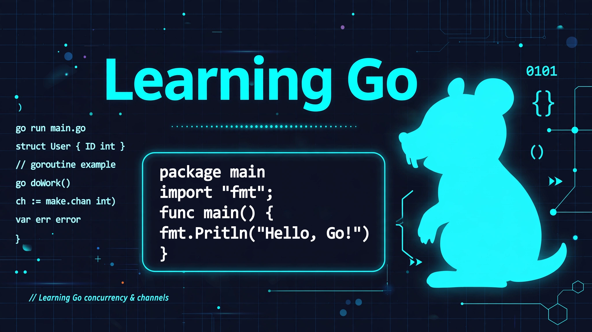

# Learning Go

> ## Status: 🟡 In Progress
>
> <progress value="40" max="100"></progress>
>
> **Progress: 40%** — Learning scratchpad: first Go program + notebook; the auto-commit watcher is the most complete piece

<p align="center">
  
</p>


## What it is

A personal Go-learning workspace. It holds early practice files (`basic.go` — the classic Hello World), a Go notebook (`go_code.ipynb`), and — the most interesting part — `auto_commit.py`, a 199-line file watcher that monitors Go files, analyzes which Go features they use (packages, imports, structs, goroutines, channels…), and auto-commits with a generated message describing what was learned.

## What works (verified)

- ✅ **`basic.go`** — Hello World, valid Go
- ✅ **`auto_commit.py`** — watches the folder, detects Go features in saved files, builds commit messages from them
- ✅ **`go_code.ipynb`** — notebook for experimenting with Go snippets
- ✅ **Python syntax valid** — `auto_commit.py` parses cleanly

## Tech stack

| Layer | Tech |
|---|---|
| Learning language | Go |
| Tooling | Python (watchdog-style file watcher), Jupyter |

## How to run

You need **Go** and **Python 3**.

```bash
# Run the Go program
go run basic.go

# Start the auto-commit watcher (commits your Go practice files with
# messages describing the Go features you used)
python3 auto_commit.py
```

## Screenshots

Not applicable — this is a learning scratchpad, not a UI project. The banner above is generated.

## What you can add more

- [ ] **Keep going through the Go tour** — structs, interfaces, goroutines, channels, one file per concept
- [ ] **Small projects** — a CLI tool, then an HTTP server, then something concurrent
- [ ] **Go modules** — `go mod init` so the repo builds as a proper module
- [ ] **Notes per concept** — a `notes/` folder with what each file teaches
- [ ] **Tests** — Go's testing is built in; practice table-driven tests early

## Project structure

```
├── basic.go          # Hello World — the starting point
├── go_code.ipynb     # Experimentation notebook
├── auto_commit.py    # File watcher: analyzes Go features, auto-commits
└── banner.webp
```

---
*README written after code audit on 2026-10-08.*
